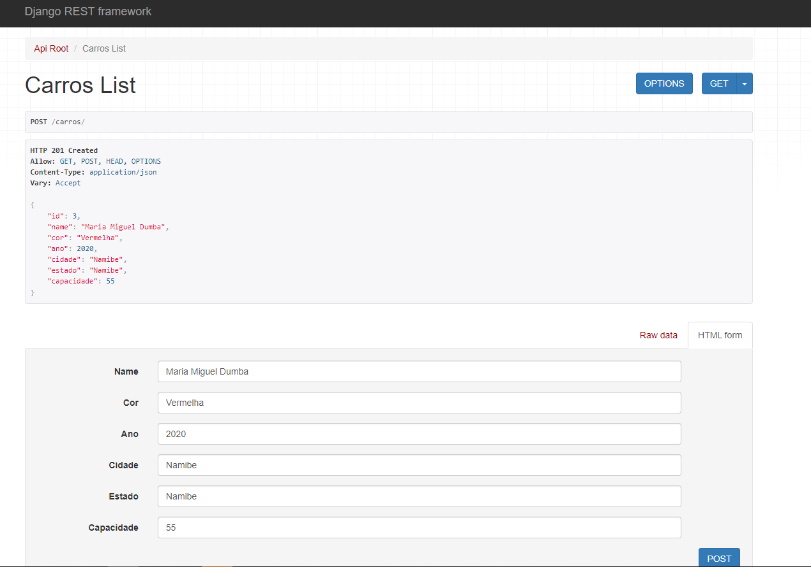

## SEGUNDO PROJECTO SOBRE WEBAPI COM DJANGO FRAMEWORK

E para manter a regularidade nos estudos sobre WEBAPI usando o Django hoje reservei mais algumas horas para estudos. Isto porque no meu caso em especifico consigo aprender com metódo da repetibilidade. isto é quanto mais vezes eu repetir melhor pra mim, assim consigo fixar o conteúdo, talvez exista uma explicação científica pra isso, mais deste jeito eu consigo fixar o conteúdo.

* Para este caso em especifico acabei praticamenete reproduzindo  os passos da primeira WEBAPI só que mudei um pouco no que diz respeito ao conteúdo que de certa forma acabou gerando mais campos para popular a API.

## 1. ESTRUTURA

 * [Descrição do Projeto](#descrição-do-projeto)

Aprender sobre WEBAPI  busquei alguns cursos e tutorias que pudessem me orientar a respeito da construção de uma WEBAPI. E para esta WEBAPI estou fazendo a inclusão de livros e autores com a suas respectivas imagens da capa, com o principal objetivo de entender quais mecanismos podem ser explorados quando se construí uma WEBPI que não é apenas argumentos textuais mais também podem ser incluídos medias como por exemplo(video, imagem, audio), nestes recuros por agora não explorei todos mais só fiquei apenas na inclusão de imagens para WEBAPI. 

* [Tecnologias utilizadas](#tecnologias-utilizadas)
 - Python3.11.3
 - MySQL
 - Servidor XAMP
 - Django Framework

* `Tecnologias utilizadas`: Funcionalidades do projeto

- `Funcionalidade 1`: Criar ambiente virtual
- `Funcionalidade 2`: Instalar as dependências
- `Funcionalidade 2a`: salvar todas as dependências no arquivo requirements.txt
- `Funcionalidade 2a`: Instalar o projeto e o seu respectivo aplicativo e indicar o nome
- `Funcionalidade 2a`: incluir o banco de dados no meu caso usei o MySQL

* [Tecnologias utilizadas](#tecnologias-utilizadas)

Estes foram os resultados obtidos.

* [Conclusão](#conclusão)
Até aqui está fazendo sentido estudar sobre WEBAPI, preciso pesquisar como emplementar um projeto completo que posso realizar a integração entre back end e front end para ter um processo mais completo a respeito desta aplicação django, já que estudei de forma separada agora está na hora de criar pontes para unir as duas partes da aplicação e criar um processo que possa melhorar minhas habilidades técnicas e assim conseguir atingir outros níveis técnicos. Por outra também sinto que devo ir atrás de aprender a documentar uma API, isto esta nos trabalhos de estudos futuros para estudos e pesquisa.Vejo que a caminhada do aprendizado é bastante longa e muito promissora então haja coragem para encarar cada desafio que vem pela frente, seguimos. 

# Autor:
By: Laurindo Dumba